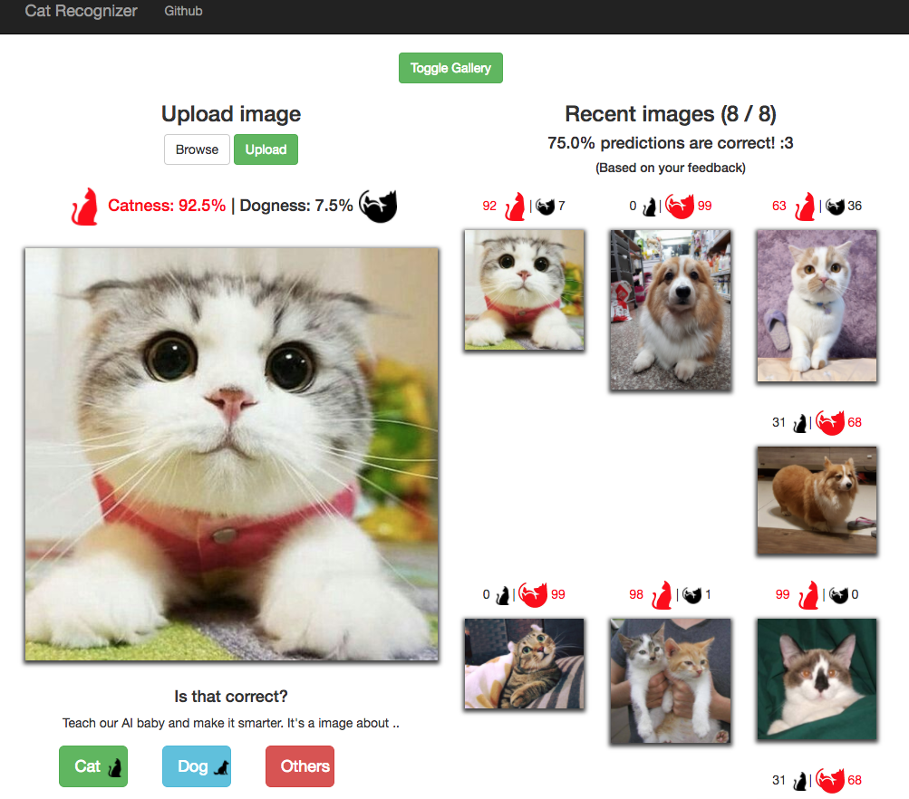

# Cat-recognition-app

This repository showcase a flask app which is able to recognize cats/dogs using TensorFlow.

However, we recommend visiting [cat-recognition-train](https://github.com/leemengtaiwan/cat-recognition-train),
where we train the model using enhanced and latest TensorFlow code. You can still reference the flask app defined in this repo to build your own web application.

## Demo run on [FC](https://www.alibabacloud.com/help/product/50980.htm)

It may take some time to boot the heroku app because we have lots of dependencies.  
The application is devided into two parts, left panel for uploading image for recognizing cats / dogs and the right panel act as gallery.

<p align="center">
  <a href="https://damp-anchorage-60936.herokuapp.com/" target="_blank"></a>
</p>

## Deploy

Open the following three products

- [FC](https://www.alibabacloud.com/help/product/50980.htm)

- [OSS](https://www.alibabacloud.com/help/product/31815.htm)

- [ACR](https://www.alibabacloud.com/help/doc-detail/60945.html)

### Step 1: Prepare the environment

An easy and simple way to install Funcraft is to download the executable binary files.

1. Install Funcraft on the local machine. For more information, see installation instructions.
2. Run fun --version to check whether the installation is successful.
3. Run fun config to configure Funcraft. Then configure Account ID, Access Key ID, Access Key Secret, and Default region name as prompted.

```bash
$ fun config
Aliyun Account ID 1234xxx
Aliyun Access Key ID xxxx
Aliyun Access Key Secret xxxx
Default region name cn-xxxx
The timeout in seconds for each SDK client invoking 300
The maximum number of retries for each SDK client 5
Allow to anonynously report usage statistics to improve the tool over time? (Y/n)
```

### Step 2: Deploy and invoke the function

```
# Substitute Image and OSS_BUCKET_NAME in template.yml
$ fun build --use-docker
$ docker login {your-ACR-registry}
$ fun deploy --push-registry acr-internet
```
